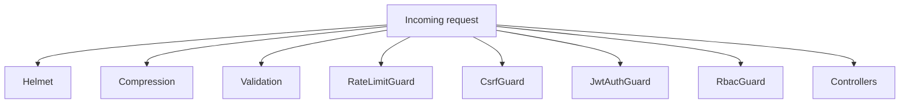
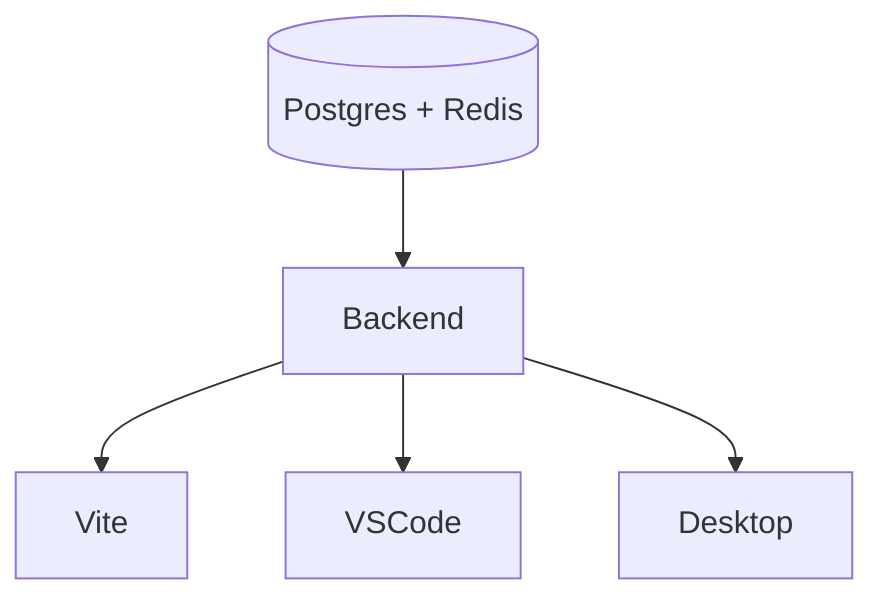

# Squirrel API Studio — System Architecture

This document maps the monorepo layout, dependency flow, startup order, and the guardrails that prevent 404/401/403/CORS errors during local development.

## Package map and roles
- **apps/web (@sdl/web)** — Vite + React web studio that calls the Nest backend through `/v1` proxies; reuses shared UI and SDK packages.
- **apps/api (@sdl/api)** — Lightweight wrapper exposing the shared sync-core entry point for CLI/test harnesses.
- **apps/desktop (@sdl/desktop)** — Placeholder for the Tauri desktop shell; uses the sync client for offline support.
- **apps/vscode (apistudio-vscode)** — VS Code extension that opens Studio workspaces and calls the backend via configurable base URLs.
- **packages/sdk (@sdl/sdk)** — Type-safe client helpers consumed by the web app and VS Code extension.
- **packages/ui (@sdl/ui)** — Reusable UI primitives (Radix + Tailwind) used by the web and Squirrel frontend.
- **packages/sync-core (@sdl/sync-core)** — CRDT/Automerge sync engine shared by API, sync harness, and clients.
- **packages/sync-client (@sdl/sync-client)** — Client bindings for sync-core plus React hooks.
- **packages/collab-client (@sdl/collab-client)** — Collaboration helpers layered on sync-client (used by the Squirrel frontend).
- **packages/sync-harness (@sdl/sync-harness)** — Test harness for sync-core correctness.
- **packages/cli (squirrel-cli)** — Node CLI entry point for API Studio tasks.
- **libs/@sdl/request-runner** — Shared HTTP request runner used by the web UI.
- **squirrel/backend (@squirrel/backend)** — NestJS monolith that serves all API routes, websockets, billing, search, AI, and sync.
- **squirrel/frontend (@sdl/squirrel-web)** — Earlier/alt web client still present for experiments; also Vite + React.
- **squirrel/gateway (@squirrel/gateway)** — NestJS API gateway/proxy intended for multi-service routing.

### Boot order
1. **Start databases** (Postgres, Redis) so Prisma, rate limiting, and websocket adapters connect cleanly.
2. **Start the backend (@squirrel/backend)**; it exposes `/v1` HTTP and `/ws` Socket.IO.
3. **Start the web client (@sdl/web)**; its Vite dev server proxies `/v1`, `/auth`, `/api`, and `/ws` to the backend.
4. Optional: **VS Code extension** or **desktop shell** can run after the backend is healthy because they target the same base URL.

## Critical dependencies and their purpose
- **NestJS (@nestjs/*)** — Core HTTP/WebSocket framework for the backend (routing, guards, validation, Swagger).【F:squirrel/backend/package.json†L6-L73】
- **Prisma (@prisma/client, prisma)** — ORM for Postgres, generated during backend install/postinstall.【F:squirrel/backend/package.json†L24-L57】
- **Redis (ioredis, bull)** — Queueing and rate-limiting store for guards and websocket scaling.【F:squirrel/backend/package.json†L24-L57】
- **Passport + JWT (@nestjs/passport, @nestjs/jwt, passport-jwt)** — Authentication/authorization with access and refresh tokens.【F:squirrel/backend/package.json†L12-L36】
- **CSRF (csurf + custom guard)** — Enforces CSRF tokens for cookie-based sessions while allowing bearer/API key flows.【F:squirrel/backend/src/common/guards/csrf.guard.ts†L1-L38】
- **Socket.IO (socket.io, @nestjs/platform-socket.io)** — Real-time collaboration and presence updates.【F:squirrel/backend/package.json†L12-L54】
- **Axios** — HTTP client for outbound calls (billing, marketplace).【F:squirrel/backend/package.json†L24-L54】
- **Framer Motion / Radix / Tailwind** — UI building blocks across web clients.【F:apps/web/package.json†L13-L37】【F:packages/ui/package.json†L19-L38】
- **Vite** — Frontend dev/build tool with proxy rules for API routes.【F:apps/web/vite.config.ts†L9-L41】
- **Zustand** — State management in web UIs with custom vendored builds.【F:apps/web/package.json†L28-L31】【F:apps/web/vite.config.ts†L12-L21】
- **Sync stack (@sdl/sync-core, @sdl/sync-client, @sdl/collab-client)** — CRDT-based offline/real-time synchronization shared by backend and clients.【F:packages/sync-core/package.json†L1-L25】【F:packages/sync-client/package.json†L1-L24】
- **VS Code (vsce, @types/vscode)** — Packaging/building the extension that hits the same API base URL.【F:apps/vscode/package.json†L60-L88】

## Startup instructions (no 404s/CORS)
1. **Install dependencies**
   ```bash
   corepack enable
   yarn install
   ```
   Yarn 4.10.3 is pinned at the repo root; Corepack ensures the right version.【F:package.json†L1-L39】
2. **Copy environment file**
   ```bash
   cp .env.example .env
   ```
   Update secrets and URLs as needed (keep `PORT=8081` to match the Vite proxy).【F:.env.example†L1-L65】
3. **Start Postgres and Redis** (optional Docker helper)
   ```bash
   docker compose -f infra/docker-compose.yml up -d postgres redis
   ```
4. **Start backend**
   ```bash
   yarn workspace @squirrel/backend dev
   ```
   The server tries `PORT` then increments on conflicts and serves `/v1/health`.【F:squirrel/backend/src/main.ts†L47-L99】
5. **Start web client**
   ```bash
   yarn workspace @sdl/web dev
   ```
   Vite proxies `/v1`, `/auth`, `/api`, and `/ws` to `http://localhost:8081`, eliminating CORS and path mismatches.【F:apps/web/vite.config.ts†L27-L54】
6. **Verify before browsing**
   - `curl http://localhost:8081/v1/health` → `{status:"ok"}` from backend.【F:squirrel/backend/src/main.ts†L68-L92】
   - `curl http://localhost:5173/v1/health` (through Vite proxy) → same JSON.
   - Open http://localhost:5173 only after both health checks succeed.
7. **Without Docker**
   - Point `DATABASE_URL`/`REDIS_URL` at existing services and ensure ports match the env file.
   - Leave proxy settings as-is; Vite still forwards to `http://localhost:8081`.

## Preventing and fixing 404s
- **Health endpoint mismatch** — The backend serves `/v1/health`; the web connectivity checker now targets `/v1/health` even when `VITE_API_URL` is set, avoiding 404s on `/health`.【F:apps/web/src/lib/config/api.ts†L1-L25】【F:squirrel/backend/src/main.ts†L68-L92】
- **Wrong base URL** — Set `VITE_API_URL` to the backend origin (no trailing slash). Vite proxies cover `/v1`, `/auth`, `/api`, `/ws`, so the UI never calls stale ports.【F:apps/web/vite.config.ts†L27-L54】【F:.env.example†L57-L65】
- **Missing CORS origin** — Include the Vite origin in `CORS_ORIGINS` to allow credentialed requests; otherwise browsers block preflight and surface 404/opaque responses.【F:.env.example†L31-L36】【F:squirrel/backend/src/main.ts†L32-L47】
- **Versioned routes** — All Nest controllers are under `/v1` because URI versioning is enabled; calling unversioned paths returns 404. Prefix client routes accordingly.【F:squirrel/backend/src/main.ts†L58-L70】
- **Swagger/docs path** — Dev-only Swagger lives at `/docs`; not available in production, so hitting it there yields 404. Use health routes instead.【F:squirrel/backend/src/main.ts†L92-L101】

## Security middleware and local-friendly usage
- **CSRF Guard** — Blocks unsafe methods without a matching `XSRF-TOKEN` cookie and `x-csrf-token` header unless using pure Bearer/API key auth. Fetch `/auth/csrf` first in cookie flows to seed the token; the backend sets `XSRF-TOKEN` automatically.【F:squirrel/backend/src/common/guards/csrf.guard.ts†L1-L38】【F:squirrel/backend/src/main.ts†L60-L75】
- **JWT + refresh cookies** — `TokenRefreshMiddleware` refreshes access tokens on each request when refresh cookies are present; keep cookies enabled in the browser.
- **Rate limiting** — `RateLimitGuard` uses Redis; ensure Redis is running or disable only in local dev (`REDIS_DISABLED=true`).【F:squirrel/backend/src/config/env.validation.ts†L10-L24】
- **Helmet & compression** — Enabled by default; no changes needed for local dev.【F:squirrel/backend/src/main.ts†L16-L33】

## Local testing checklist
- [ ] `PORT` in `.env` matches Vite proxy target (default 8081).【F:.env.example†L5-L12】【F:apps/web/vite.config.ts†L27-L54】
- [ ] Postgres reachable via `DATABASE_URL`; Prisma migrations apply on start.【F:.env.example†L7-L12】【F:squirrel/backend/package.json†L18-L23】
- [ ] Redis reachable via `REDIS_URL`; guards and Socket.IO adapter boot without warnings.【F:.env.example†L13-L20】【F:squirrel/backend/src/config/env.validation.ts†L14-L26】
- [ ] `curl http://localhost:8081/v1/health` returns `status: ok`.【F:squirrel/backend/src/main.ts†L68-L92】
- [ ] `curl http://localhost:5173/v1/health` returns the same through Vite proxy.【F:apps/web/vite.config.ts†L27-L54】
- [ ] CSRF token set by hitting `/auth/csrf` before POST/PUT/DELETE when using cookies.【F:squirrel/backend/src/main.ts†L60-L75】【F:squirrel/backend/src/common/guards/csrf.guard.ts†L10-L33】
- [ ] Access token present in Authorization header for protected routes.
- [ ] WebSocket client connects to `/ws` and receives presence updates (Redis adapter running).

## Diagrams
### Workspace layout
```mermaid
graph TD
  root[repo root]
  root --> apps
  root --> packages
  root --> libs
  root --> squirrel
  apps --> web[@sdl/web]
  apps --> api[@sdl/api]
  apps --> desktop[@sdl/desktop]
  apps --> vscode[VS Code extension]
  packages --> sdk[@sdl/sdk]
  packages --> ui[@sdl/ui]
  packages --> synccore[@sdl/sync-core]
  packages --> syncclient[@sdl/sync-client]
  packages --> collab[@sdl/collab-client]
  packages --> harness[@sdl/sync-harness]
  packages --> cli[squirrel-cli]
  libs --> requestRunner[@sdl/request-runner]
  squirrel --> backend[@squirrel/backend]
  squirrel --> frontend[@sdl/squirrel-web]
  squirrel --> gateway[@squirrel/gateway]
```

### Dependency and request flow
```mermaid
graph LR
  Browser[Web UI (Vite)] -- /v1, /auth, /api --> Backend[NestJS backend]
  VSCode[VS Code Extension] -- REST/WS --> Backend
  Desktop[Desktop shell] -- REST/WS --> Backend
  Backend -- Prisma --> Postgres
  Backend -- Redis adapter --> Redis
  Backend -- Socket.IO --> Clients
  Backend -- Paynow API --> Paynow
```

### Security middleware flow


### Startup order


## Troubleshooting quick fixes
- **404** — Confirm requests include `/v1` prefix and `VITE_API_URL` matches backend origin (no trailing slash). Re-run health checks through Vite proxy.【F:apps/web/src/lib/config/api.ts†L1-L25】【F:apps/web/vite.config.ts†L27-L54】
- **401/403** — Acquire CSRF token and include `x-csrf-token` header for cookie sessions; ensure Authorization bearer tokens are fresh (TokenRefreshMiddleware handles cookies).【F:squirrel/backend/src/common/guards/csrf.guard.ts†L10-L33】
- **CORS** — Add frontend origin to `CORS_ORIGINS` and restart backend; dev default `true` is used when unset but production requires explicit origins.【F:squirrel/backend/src/main.ts†L32-L47】【F:.env.example†L31-L36】
- **CSRF** — Call `/auth/csrf` to obtain `XSRF-TOKEN` and mirror it in `x-csrf-token` for unsafe methods.【F:squirrel/backend/src/main.ts†L60-L75】
- **Database** — Verify `DATABASE_URL` and that Postgres is up; Prisma will fail startup otherwise.【F:.env.example†L5-L12】【F:squirrel/backend/package.json†L18-L23】
- **Proxy errors** — Ensure Vite dev server is running and backend listens on `PORT`; the proxy forwards `/v1`/`/auth`/`/api`/`/ws` to the backend origin.【F:apps/web/vite.config.ts†L27-L54】
